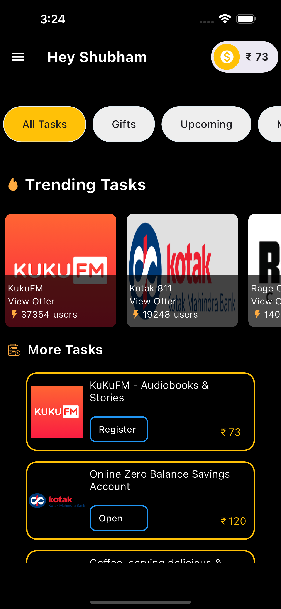
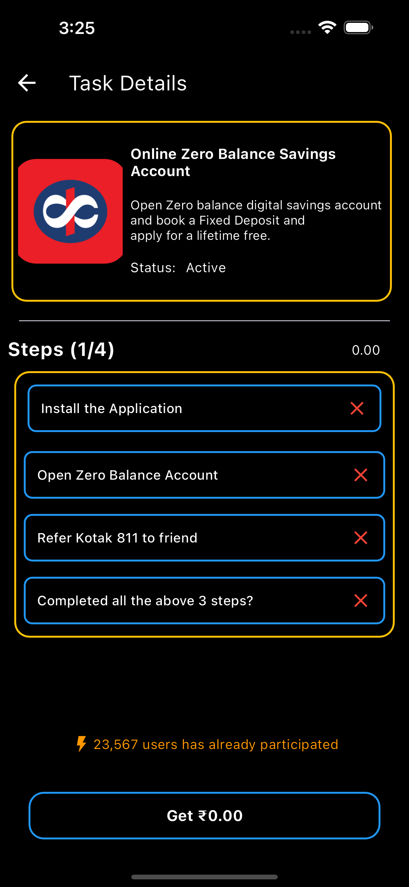

# Intern_Assignment_Flutter

TaskRewards, an mobile application developed as part of my intern assignment, revolutionizes task completion by offering monetary rewards. The app employs a ListView Builder on its first screen, allowing users to seamlessly scroll through and select tasks sourced from given JSON data. Each task is visually enhanced with a thumbnail image, showcasing the "trending tasks" from the given dataset. The use of Containers ensures a structured layout, providing a user-friendly and visually appealing interface.

In Screen 2, TaskRewards provides a detailed overview of the tasks, offering a step-by-step breakdown of the four essential steps needed to achieve the reward. Furthermore I incorporated custom fonts, colors, and icons elevates the app's design, creating a visually immersive experience. An essential feature is the use of a ChangeNotifierProvider, playing a pivotal role in updating the state of the rewarded money. The user's earned money is prominently displayed in the top-right corner of Screen 1, accompanied by an icon for easy identification. Additionally I have manipulated the given json data into a model(om model) to use it across for the development of the app. By leveraging the OM model, I've successfully integrated the provided JSON data into both Screen 1 and Screen 2.

# Screenshots of the Assignment

